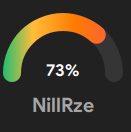
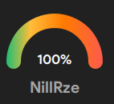
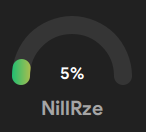

# Circular Gauge ProgressBar
This is a Circular Gauge ProgressBar written in QML based on CircularGauge

## Usage

```sh
CustomCircularGauge {
                id: cpuGauge
                width: 120
                ptyValue: 73
                ptyTitle: "NillRze"
                ptyCircleGaugeBackgroundHeight : 18
            }

```            
 

 

 

